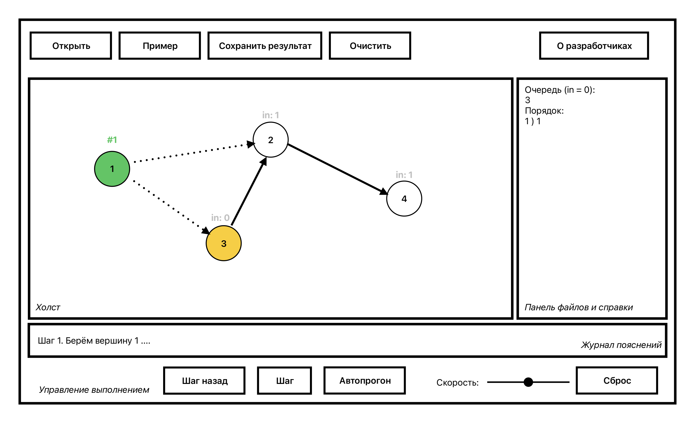

# Спецификация: Визуализатор топологической сортировки

Тема мини-проекта: Топологическая сортировка (алгоритм Кана).

## 1. Назначение программы

Приложение показывает по шагам работу алгоритма топологической сортировки ориентированного графа (алгоритм Кана). Пользователь задаёт граф (из файла или мышью на холсте), запускает пошаговую визуализацию и видит, как алгоритм считает входящие степени вершин, кладёт вершины с нулевой степенью в очередь и по одной выбирает их в итоговый порядок, удаляя исходящие рёбра. Если очередь опустела, а необработанные вершины остались - граф содержит цикл, и сортировка невозможна; программа сообщает об этом и подсвечивает оставшиеся вершины. Результат (топологический порядок или сообщение о цикле) сохраняется в файл.

## 2. Функциональные требования

### 2.1. Требования к вводу исходных данных
- Из файла (кнопка Открыть, диалог выбора файла).
- В самом приложении мышью:
  - клик левой кнопкой по пустому месту холста - создать вершину в этой точке;
  - клик по вершине, затем по другой вершине - создать ориентированное ребро от первой ко второй;
  - перетаскивание вершины левой кнопкой - переместить её;
  - клик правой кнопкой по вершине или ребру - удалить элемент (для вершины с рёбрами - с подтверждением);
  - кнопка Очистить - удалить весь граф (с подтверждением).
- Кнопка Пример - загрузка встроенного демонстрационного графа.
- Ограничения: 1 <= вершин <= 50, 0 <= рёбер <= 300. Петли (ребро из вершины в саму себя) и повторные рёбра с теми же началом и концом не допускаются; встречные рёбра (u->v и v->u) допускаются - алгоритм честно найдёт такой цикл.

### 2.2. Требования к визуализации
- Вершины - круги с подписями-номерами; рёбра - линии со стрелками (направление видно по стрелке).
- Рядом с каждой необработанной вершиной подписана её текущая входящая степень (in). Вершины в очереди выделяются жёлтой заливкой, обработанные - зелёной с номером позиции в порядке, текущая - красным жирным контуром.
- Рёбра, уже удалённые алгоритмом, рисуются серым пунктиром.
- Пошаговое выполнение, шаги мелкие: одна вершина обрабатывается за два шага - сначала она берётся из очереди (подсвечивается вместе со своими исходящими рёбрами), затем рёбра удаляются, степени соседей уменьшаются, новые нули попадают в очередь.
- Текстовые пояснения каждого шага - в журнале под холстом; последнее пояснение дублируется в строке состояния.
- Панель справа показывает текущее состояние: содержимое очереди и уже построенный порядок.
- Граф целиком помещается в окно: координаты масштабируются под размер холста, при изменении размера окна рисунок перестраивается.

### 2.3. Требования к управлению выполнением
- Кнопка Шаг - один шаг вперёд.
- Кнопка Шаг назад - откат на один шаг.
- Кнопка Автопрогон - автоматические шаги с интервалом, задаваемым ползунком (100..2000 мс); повторное нажатие - пауза.
- Кнопка Сброс - вернуть алгоритм к началу (граф сохраняется).
- Во время выполнения алгоритма редактирование графа блокируется (до сброса).

### 2.4. Требования к выводу результатов
- В конце в журнал выводится топологический порядок вершин, либо сообщение, что граф содержит цикл (с перечнем необработанных вершин).
- Кнопка Сохранить результат - запись результата в текстовый файл.

### 2.5. Прочие требования
- Кнопка "О разработчиках"
- Обработка ошибок: некорректный входной файл не роняет программу - показывается сообщение с описанием ошибки и номером строки.

## 3. Пользовательский интерфейс



Рисунок 1 - эскиз главного окна. Сверху панель работы с файлами, в центре холст с графом, справа панель состояния алгоритма (очередь готовых и построенный порядок), внизу журнал пояснений, строка состояния и кнопки управления выполнением. На эскизе показана середина работы: вершина 1 обработана (зелёная, #1), её рёбра удалены (пунктир), вершина 3 освободилась и стоит в очереди (жёлтая, in:0). Диалоги стандартные: выбор файла, подтверждения, ошибки, "О разработчиках".

## 4. Алгоритм

Алгоритм Кана: (1) посчитать входящую степень каждой вершины; (2) положить в очередь все вершины со степенью 0; (3) пока очередь не пуста: взять вершину из очереди, дописать её в итоговый порядок, удалить её исходящие рёбра, уменьшив степени соседей; вершины, у которых степень стала 0, добавить в очередь; (4) если обработаны все вершины - порядок построен; если очередь пуста, а вершины остались - в графе есть цикл, сортировка невозможна. Сложность O(V + E).

Шаг визуализации: старт (подсчёт степеней и заполнение очереди), затем по два шага на вершину (взять из очереди / удалить рёбра), в конце итоговый шаг. Шаг назад выполняется сбросом алгоритма и повторным прогоном на один шаг меньше: алгоритм детерминирован, поэтому состояние восстанавливается точно.

## 5. Форматы данных

### 5.1. Входной файл графа
```
V <номер> <x> <y>     - вершина: номер 1..50, координаты 0..1000
E <из> <в>            - ориентированное ребро
```
Пример:
```
V 1 100 100
V 2 400 100
V 3 100 350
E 1 2
E 1 3
E 3 2
```
Ошибки формата диагностируются с номером строки; ссылки на несуществующие вершины, координаты вне 0..1000, петли и повторные рёбра отклоняются.

### 5.2. Выходной файл результата
```
Топологическая сортировка (алгоритм Кана)
Вершин: 7, рёбер: 8
Топологический порядок: 1 3 2 5 4 7 6
```
Для графа с циклом вместо порядка пишется сообщение о цикле и список необработанных вершин.

## 6. План разработки и распределение ролей

По плану практики:

Спецификация и план - настоящий документ.

Прототип - окно с зонами по эскизу, кнопки могут быть неактивны, холст рисует демонстрационный граф со стрелками.

Альфа - граф загружается из файла и рисуется в окне; при запуске выводится финальный результат работы алгоритма.

Бета - пошаговое выполнение с пояснениями и подсветкой; результат сохраняется в отдельный файл.

Финальная версия - шаг назад, автопрогон с задаваемым интервалом, редактирование графа мышью, обработка исключительных ситуаций, кнопка "О разработчиках".

Роли:
- Беспалов Александр Александрович 4383
- Серженко Дмитрий Кириллович 4383
- Мазеев Владислав Антонович 4381

